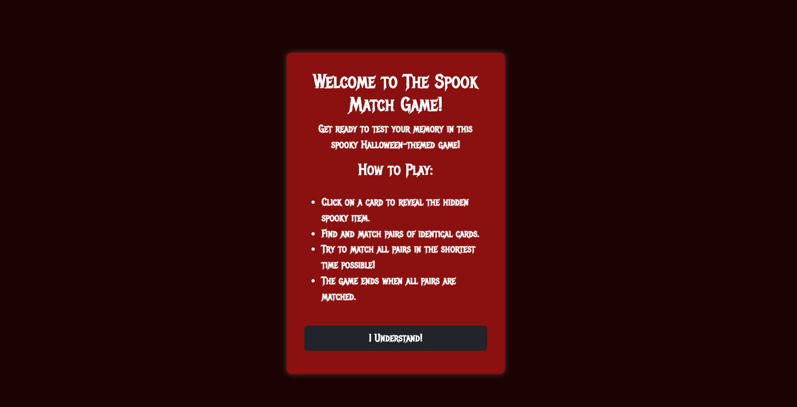
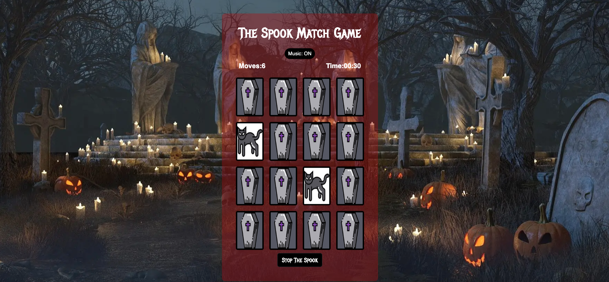
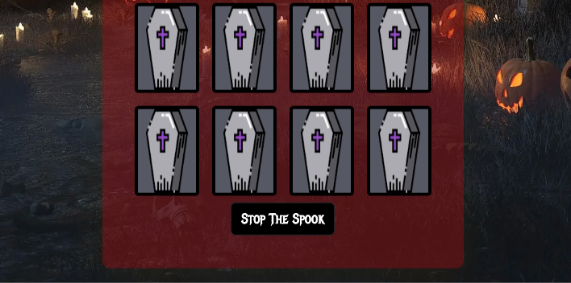
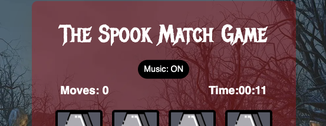
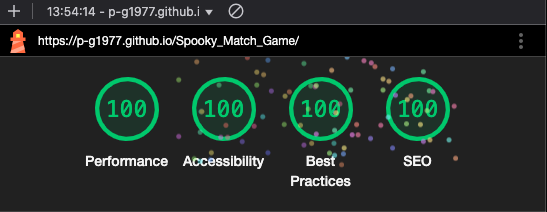

# The Spook Match Game - Milestone two

[View live project here.](https://p-g1977.github.io/Spooky_Match_Game/)

The Spook Match Game is a thrilling Halloween-themed memory challenge designed to test your wits and speed! Dive into a spooky world filled with eerie icons like bats, cauldrons, and zombies as you attempt to uncover and match pairs of cards. The goal is simple: find all the matching pairs in as few moves and as little time as possible. With an immersive atmosphere, complete with haunting background music and eerie visuals, this game will keep you entertained while sharpening your memory skills.

As you play, every move counts! Each match you find brings you closer to victory, but the challenge lies in remembering where each card is hidden. The game keeps track of your time and number of moves, pushing you to improve your performance with every round. Whether you're playing casually for fun or competing to beat your best time, Spook Match Game offers a perfect balance of excitement and brain-teasing fun. The randomly shuffled cards ensure that every game is a unique experience, keeping you on your toes with each new attempt.

## Features

* The Modal

  * Introduction & Instructions: The modal welcomes players to The Spook Match Game and provides a brief introduction to the game, setting the spooky atmosphere.

  * How to Play: It outlines the game mechanics in a simple bullet-point list, explaining how to flip cards, match pairs, and complete the game as quickly as possible.

  * User Interaction: The modal includes a button labeled "I Understand!" that allows players to close the modal and start the game, ensuring they have read the instructions before playing.

    

* The Start Button

  * Game Initialization: After clicking the "I Understand" button on the Modal. The Start The Spook button starts the game, starting the time, moves-count, and a new set of shuffled cards.

    

* The Full Game

  * Spooky Memory Challenge: The Spook Match Game is a Halloween-themed memory game where players flip cards to find matching spooky pairs, testing their memory and concentration.

  * Timed & Move-Based Gameplay: Players must match all pairs as quickly as possible while keeping their move count low, adding a competitive and strategic element to the game.

  * Immersive Experience: With eerie background music, creepy visuals, and a suspenseful atmosphere, the game creates a fun and engaging spooky adventure for players of all ages.

    
  
  * Endless Replayability: Each game is different thanks to the random card shuffle, encouraging players to keep improving their speed and memory skills with every round.

* Stop The Spook Button

  * Game Reset & Results Display: Pressing the Stop The Spook button ends the game, stops the timer, pauses the background music, and displays the player's final move count and time, allowing them to see their performance.

    

* Losing Results

  * "You Lost" Message: If the player stops the game before matching all pairs, the results screen displays a "You Lost" message, indicating that the challenge was not completed.

  * Performance Summary: The screen shows the total number of moves and the elapsed time, allowing the player to reflect on their attempt and try again for a better result.

    

* Winning Results

  * "You Won!" Celebration: The winning screen displays a "You Won!" message, congratulating the player for successfully matching all the spooky pairs.

  * Final Stats Display: The screen shows the player's total number of moves and the time taken to complete the game, encouraging them to beat their own record in future rounds.

  * Game Reset Prompt: After winning, the player can restart the game to try again with a new shuffled set of cards, keeping the challenge fresh and engaging.

    

  * Challenge Yourself: Try to beat the game even faster next time by improving your memory and matching all pairs in fewer moves and a shorter time!

* Music On / Off Choice

  * Music Toggle Feature: Players can turn the spooky background music on or off at any time using the Music: ON/OFF button for a customized gaming experience.

    

### Features Left To Implement

* I would like to have an option to play with more or less cards to increase / decrease difficulty. And have the ability to play aginst the timer to add an extra layer of challenge.

## Testing

* Accessibiliy

  * I ran the page through Lighthouse and the performance score result showed 96. I found out that if I removed the unused script kit for FontAwesome I may get better performance results. After removing the script I scored 100 across the 5 categories.

    
