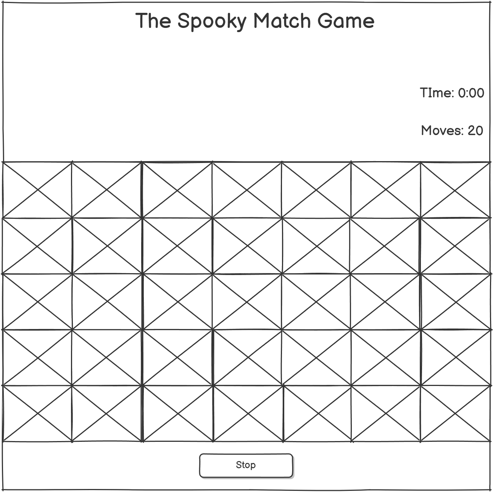

# The Spook Match Game - Milestone Two

[View live project here.](https://p-g1977.github.io/Spooky_Match_Game/)

The Spook Match Game is a thrilling Halloween-themed memory challenge designed to test your wits and speed! Dive into a spooky world filled with eerie icons like bats, cauldrons, and zombies as you attempt to uncover and match pairs of cards. The goal is simple: find all the matching pairs in as few moves and as little time as possible. With an immersive atmosphere, complete with haunting background music and eerie visuals, this game will keep you entertained while sharpening your memory skills.

As you play, every move counts! Each match you find brings you closer to victory, but the challenge lies in remembering where each card is hidden. The game keeps track of your time and number of moves, pushing you to improve your performance with every round. Whether you're playing casually for fun or competing to beat your best time, Spook Match Game offers a perfect balance of excitement and brain-teasing fun. The randomly shuffled cards ensure that every game is a unique experience, keeping you on your toes with each new attempt.


## Design

* Color Scheme

| Main Colors  | Typorgraphy  |
| ------------ |:------------ |
| Black        | White        |
| White        |              |
| #f30808      |              |
| #880808      |              |

* Typography


Metal Mania font by [Google Fonts](https://fonts.google.com/?query=metal+mania) was used for most of the text on the game. The fallback "sans-serif" font was used on the Music On/Off button, the timer and moves count. The Metal Mania font looked relevant for this halloween themed game.

* imagery

  * The main game design is based around Halloween themed imagery. The background image is a graveyard and the cards for the game are all Halloween / Horror related.

  


## Features

* The Modal

  * Introduction & Instructions: The modal welcomes players to The Spook Match Game and provides a brief introduction to the game, setting the spooky atmosphere.

  * How to Play: It outlines the game mechanics in a simple bullet-point list, explaining how to flip cards, match pairs, and complete the game as quickly as possible.

  * User Interaction: The modal includes a button labeled "I Understand!" that allows players to close the modal and start the game, ensuring they have read the instructions before playing.

    

* The Start Button

  * Game Initialization: After clicking the "I Understand" button on the Modal. The Start The Spook button starts the game, starting the time, moves-count, and a new set of shuffled cards.

    

* The Full Game

  * Spooky Memory Challenge: The Spook Match Game is a Halloween-themed memory game where players flip cards to find matching spooky pairs, testing their memory and concentration.

  * Timed & Move-Based Gameplay: Players must match all pairs as quickly as possible while keeping their move count low, adding a competitive and strategic element to the game.

  * Immersive Experience: With eerie background music, creepy visuals, and a suspenseful atmosphere, the game creates a fun and engaging spooky adventure for players of all ages.

    
  
  * Endless Replayability: Each game is different thanks to the random card shuffle, encouraging players to keep improving their speed and memory skills with every round.

* Stop The Spook Button

  * Game Reset & Results Display: Pressing the Stop The Spook button ends the game, stops the timer, pauses the background music, and displays the player's final move count and time, allowing them to see their performance.

    

* Losing Results

  * "You Lost" Message: If the player stops the game before matching all pairs, the results screen displays a "You Lost" message, indicating that the challenge was not completed.

  * Performance Summary: The screen shows the total number of moves and the elapsed time, allowing the player to reflect on their attempt and try again for a better result.

    

* Winning Results

  * "You Won!" Celebration: The winning screen displays a "You Won!" message, congratulating the player for successfully matching all the spooky pairs.

  * Final Stats Display: The screen shows the player's total number of moves and the time taken to complete the game, encouraging them to beat their own record in future rounds.

  * Game Reset Prompt: After winning, the player can restart the game to try again with a new shuffled set of cards, keeping the challenge fresh and engaging.

    

  * Challenge Yourself: Try to beat the game even faster next time by improving your memory and matching all pairs in fewer moves and a shorter time!

* Music On / Off Choice

  * Music Toggle Feature: Players can turn the spooky background music on or off at any time using the Music: ON/OFF button for a customized gaming experience.

    

* 404 Error Page

  * Error page: If a player accidentally navigates to an incorrect page, the 404 error page will show which has a link to redirect the player to the home page.

    

### Features Left To Implement

* I would like to have an option to play with more or less cards to increase / decrease difficulty. And have the ability to play against the timer to add an extra layer of challenge.

## Testing

* Accessibiliy

  * I ran the page through Lighthouse and the performance score result showed 96. I found out that if I removed the unused script kit for FontAwesome I may get better performance results. After removing the script I scored 100 across the 5 categories.

    

* Chrome, Safari and Firefox browsers have been tested and they all work with the game.

* I have tested the game on Iphone 12, Iphone SE, Samsung Galaxy Flip 2 and Samsung Galaxy S24.

* I have made sure the colors contrast well together to keep the elements easily identifiable and readable.

* HTML

  * I ran the code through [W3C HTML validator](https://validator.w3.org/nu/?showsource=yes&doc=https%3A%2F%2Fp-g1977.github.io%2FSpooky_Match_Game%2F) and there were no errors or warnings.

    

* CSS

  * I ran the code through [W3C CSS validator](https://validator.w3.org/nu/?showsource=yes&doc=https%3A%2F%2Fp-g1977.github.io%2FSpooky_Match_Game%2F#textarea) and there were also no errors or warnings.

    

* JavaScript

  * I ran the code through [JS Hint](https://jshint.com/) and discovered 83 warnings with 'Two undefined variables'. I had not declared the 2 variables firstCardValue and secondCardValue. I declared the 2 variables and fixed the problem. However the 83 warnings I was not able to fix as far as I know. No errors. 

    

* Feature Testing

  * The Modal will show the game rules when the screen first loads, the game start button will show when the "I Understand" button is clicked.

  * The "Start The Spook" button will stat the game when clicked.

  * I tested that only two cards can be uncovered at a time and they reset when the next card is flipped.

  * The moves count moves incremental by one every time two cards are flipped.

  * The timer starts when the game starts and will not cut off until the game is finished or if the game is stopped by pressing "Stop The Spook".

  * When the game is won the winning screen shows the correct moves and time.

  * When the game is stopped the losing screen shows the correct moves and time.

  * The music on / off button stops and restarts the music when clicked.

  * All features have been tested on Desktop, Tablet, and Mobile devices.

## Bugs (Problems / Fixes)

* When designing the basic version of the game I had a meeting with my Mentor who pointed out that the card flipping code could be broken by continually flipping the cards, because there was no restriction on clicking additional cards while two were already flipped, which could lead to unintended behavior. Upon further research on [StackOverflow](https://stackoverflow.com/questions/33498769/why-does-javascript-operator-return-the-second-expression) and [Reddit](https://www.reddit.com/r/learnprogramming/comments/qcc927/when_does_returns_the_first_falsy_value_and_when/) I added  ```if (firstCard && secondCard) return; ``` at the beginning of the click event. This ensures that once two cards are flipped, no further cards can be clicked until the current pair is either matched or flipped back.

* Upon further development of the game I decided it would create a more unsettling environment to add music to the game. I talked about this to my Mentor who let me know that if I were to add music, I would need to add something to the game to turn the music off. I first added the music with the HTML ```<Audio loop controls>``` element. Unfortunately this revealed large, rather ugly audio default play, pause, and volume controls. I removed the "controls" from the ```<Audio>``` element and designed a ```<button>``` in HTML and styled ```.audio-toggle``` in CSS. Then after reading an article from [freeCodeCamp](https://forum.freecodecamp.org/t/power-on-off-button-to-control-audio/459693) created the JavaScript code using the ```audio``` variable. The ```id="audio-toggle"``` is used to toggle the music on and off, and the JavaScript logic listens for click and either plays or pauses the audio. I set the ```audio.volume = 0.2;```, as this sounded the best across the devices tested.
At first I incorrctly placed the ```<button>``` outside of the game ```.wrapper``` and the audio on / off button was at the corner of the screen. After loading the game on my mobile i discovered the button was hidden underneath the game and I was unable to toggle the audio. After moving the HTML ```<button>``` inside the ```.game-container``` and placing correctly with CSS, the music on/off button was nicely placed in the game below the game title.

* The last bug was simple to solve. I had to click the music on / off button twice to turn the music off, but after that it would click on / off without error. After looking at the game on DevTools and then looking at the JavaScript I realised I had incorrectly set the ```let isAudioPlaying = false;``` instead of ```let isAudioPlaying = true;```. This bug was then fixed and the music plays and toggles on / off without clicking twice.

### Unfixed Bugs

* There are no unfixed bugs

## Technologies Used

### Languages Used

* [HTML5](https://en.wikipedia.org/wiki/HTML5) 

* [CSS3](https://en.wikipedia.org/wiki/CSS#CSS_3)

* [JavaScript (ES6+)](https://en.wikipedia.org/wiki/JavaScript)

### Frameworks, Libraries & Programs Used

1. [Bootstrap v5.3](https://getbootstrap.com/docs/5.3/getting-started/introduction/) 

    * Boostrap was used to assist with the responsiveness and styling of the project.

2. [Google Fonts](https://fonts.google.com/) 

    * Google fonts were used to import the "Metal Mania" font into the style.css file which is used on all the pages throughout the project.

3. [Visual Studio Code](https://code.visualstudio.com/) 

    * Visual Studio Code was the source code editor, designed for writing and editing code efficiently.

4. [GIT](https://git-scm.com/)

    * Git was used for the version control by utilizing the Visual Studio Code terminal to commit to Git and Push to GitHub.

5. [GitHub](https://github.com/)

    * GitHub is used to store the projects code after being pushed to GitHub.

6. [Favicon](https://favicon.io/favicon-generator/)

    * [Favicon generator](https://favicon.io/favicon-generator/) was used to create the Favicon for the website.

7. [Balsamiq](https://balsamiq.com/)

    * Balsamiq was used to create the wireframes during the design process.


## Deployment

### Version Control

* This site was created using Visual Studio Code editor and pushed to Github to the remote repository 'Spooky_Match_Game'.
* Git commands were used throughout the development to push the code to the remote repository. The following Git commands were used.
    * git add . | To add the files to the staging area before being commited.
    * git commit -m "commit message" | To commit changes to the local repository queue.
    * git push | To push all commited code to the remote repository on Github

### Deployment to Github

* I deployed this site to Github as follows.
    * In the Github repository navigate to the Settings tab.
    * At the source section drop-down menu, select the Master branch and save.
    * When the Master branch is selected, the page will provide a link to the website.
* The live link is: [The Spook Match Game](https://p-g1977.github.io/Spooky_Match_Game/)

### Forking the Github Repository

* Log into GitHub and locate [Spooky Match Game](https://github.com/P-G1977/Spooky_Match_Game).
* At the top of the repository (not top of page) just above the 'Settings' Button on the menu, locate the 'Fork' Button.
* You should now have a copy of the original repository in your GitHub account. However this WILL NOT affect the original repository but will just make a copy.

### Making a Local Clone

1. Log in to GitHub and locate [P-G1977/Spooky_Match_Game](https://github.com/P-G1977/Spooky_Match_Game).
2. Under the repository name, click 'Clone or download'.
    * To download the Zip file click the 'Download Zip' at the bottom of the dropdown menu.
3. To clone the repository using HTTPS, under 'Clone with HTTPS', copy the link.
4. Open Git Bash.
5. Change the current working directory to the location where you want the cloned directory to be made.
6. Type `git clone`, and then paste the URL you copied in Step 3.
  `$ git clone https://github.com/P-G1977/Spooky_Match_Game.git`
7. Press Enter. Your local clone will be created.

## Wireframe

  * The Wireframe I made was pretty simple. It shows the original design layout, which was changed and altered when building the project.



## Credits

### Images

* All card images were used from [FLATICON](https://www.flaticon.com/packs/halloween-8#) and the designer of the Flaticon cards is [Freepik](https://www.freepik.com)

* The background Graveyard image was used from [pixabay](https://pixabay.com/photos/pumpkins-halloween-night-gruesome-7555083) and the designer of the image is [anaterate](https://pixabay.com/users/anaterate-2348028/)

### Music

* The Spooky music was taken from [pixabay](https://pixabay.com/) and the title of the audio is 'Scary night' and was created by [freesound_community](https://pixabay.com/users/freesound_community-46691455)

### Content

* The original idea came from [Code Institute](https://codeinstitute.net/) with the listed ideas for the Milestone Two project. Research was made and ideas taken from [Dev Community](https://dev.to/fakorededamilola/create-a-memory-game-with-js-1l9j) helped a lot for the original basic game. 

### Support

* I'd like to give a special thank you to my Mentor, Spencer Barriball. He has helped so much with troubleshooting, and answering all my questions.  