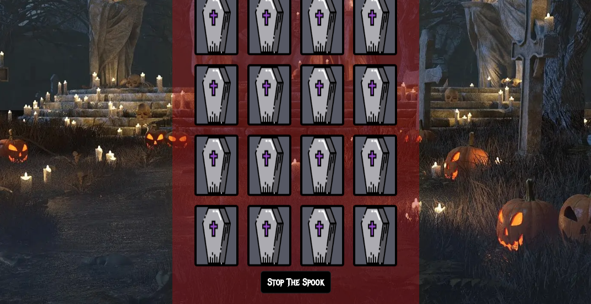

# The Spook Match Game - Milestone Two

[View live project here.](https://p-g1977.github.io/Spooky_Match_Game/)

The Spook Match Game is a thrilling Halloween-themed memory challenge designed to test your wits and speed! Dive into a spooky world filled with eerie icons like bats, cauldrons, and zombies as you attempt to uncover and match pairs of cards. The goal is simple: find all the matching pairs in as few moves and as little time as possible. With an immersive atmosphere, complete with haunting background music and eerie visuals, this game will keep you entertained while sharpening your memory skills.

As you play, every move counts! Each match you find brings you closer to victory, but the challenge lies in remembering where each card is hidden. The game keeps track of your time and number of moves, pushing you to improve your performance with every round. Whether you're playing casually for fun or competing to beat your best time, Spook Match Game offers a perfect balance of excitement and brain-teasing fun. The randomly shuffled cards ensure that every game is a unique experience, keeping you on your toes with each new attempt.


## Project Explanation

Spook Match is a fun, Halloween-themed memory card game designed to entertain users while testing their memory and concentration skills through matching spooky character pairs within a timed challenge.

### Client Goals

This project was developed as part of my Diploma in Web Application Development, serving as a practical milestone in building interactive, JavaScript-driven web applications. While there was no real-life client, I approached Spook Match as a professional-grade product, focusing on clean structure, user engagement, and alignment with potential client expectations.

* Delivering an interactive memory-matching game that challenges users’ focus, pattern recognition, and memory skills.

* Offering a playful, spooky-themed game suitable for seasonal promotions or casual gaming platforms.

* Encouraging repeated playthroughs through simple mechanics, time tracking, and a scoring system that motivates improvement.

* Adding value to a potential client’s web content with a fun, themed browser game that enhances user engagement and time on site.

* Ensuring accessibility with a fully browser-based, lightweight game that works across desktop and mobile devices.

* Providing a friendly, visually engaging interface that reflects strong frontend design and coding principles.

### User Goals

The target audience for Spook Match includes casual gamers of all ages who enjoy themed memory challenges and lighthearted fun.

  * Test their memory and focus by matching spooky card pairs under time pressure.

  * Enjoy a festive, Halloween-inspired design that adds charm to each game session.

  * Dive into gameplay that's simple to understand, yet rewarding to master.

  * Challenge themselves to beat previous scores with fewer moves and faster times.

  * Play instantly in the browser with no downloads or installations required.

  * Relax and have fun during quick breaks, seasonal events, or casual game nights.

## User Stories

Spook Match is designed as a light, casual memory game that draws players in with its spooky theme, simple gameplay, and quick rounds. It’s ideal for users looking to unwind, pass time, or enjoy a short challenge—whether as part of a larger entertainment platform or a standalone experience.

* User

  * I want to play a fun and spooky memory game that’s easy to understand.

  * I want to challenge my memory and concentration in a casual, low-pressure setting.

  * I want a game that’s quick to load and works right in the browser without needing to install anything.

  * I want to enjoy short, engaging sessions that I can play during breaks or downtime.

  * I want the game to have intuitive controls and a responsive interface.

  * I want a smooth experience without bugs or slowdowns, even on mobile.

  * I want to improve my performance over time by trying to match cards faster and with fewer moves.

  * I want a game that’s visually appealing and keeps me coming back for another round.

  * I want to be able to toggle the background music on or off depending on my environment or preference.


## Design

* Color Scheme

| Main Colors  | Typorgraphy  |
| ------------ |:------------ |
| Black        | White        |
| White        |              |
| #f30808      |              |
| #880808      |              |

* Typography


Metal Mania font by [Google Fonts](https://fonts.google.com/?query=metal+mania) was used for most of the text on the game. The fallback "sans-serif" font was used on the Music On/Off button, the timer and moves count. The Metal Mania font looked relevant for this halloween themed game.

* imagery

  * The main game design is based around Halloween themed imagery. The background image is a graveyard and the cards for the game are all Halloween / Horror related.

  


## Features

* The Modal

  * Introduction & Instructions: The modal welcomes players to The Spook Match Game and provides a brief introduction to the game, setting the spooky atmosphere.

  * How to Play: It outlines the game mechanics in a simple bullet-point list, explaining how to flip cards, match pairs, and complete the game as quickly as possible.

  * User Interaction: The modal includes a button labeled "I Understand!" that allows players to close the modal and start the game, ensuring they have read the instructions before playing.

    

* The Start Button

  * Game Initialization: After clicking the "I Understand" button on the Modal. The Start The Spook button starts the game, starting the time, moves-count, and a new set of shuffled cards.

    

* The Full Game

  * Spooky Memory Challenge: The Spook Match Game is a Halloween-themed memory game where players flip cards to find matching spooky pairs, testing their memory and concentration.

  * Timed & Move-Based Gameplay: Players must match all pairs as quickly as possible while keeping their move count low, adding a competitive and strategic element to the game.

  * Immersive Experience: With eerie background music, creepy visuals, and a suspenseful atmosphere, the game creates a fun and engaging spooky adventure for players of all ages.

    
  
  * Endless Replayability: Each game is different thanks to the random card shuffle, encouraging players to keep improving their speed and memory skills with every round.

* Stop The Spook Button

  * Game Reset & Results Display: Pressing the Stop The Spook button ends the game, stops the timer, pauses the background music, and displays the player's final move count and time, allowing them to see their performance.

    

* Losing Results

  * "You Lost" Message: If the player stops the game before matching all pairs, the results screen displays a "You Lost" message, indicating that the challenge was not completed.

  * Performance Summary: The screen shows the total number of moves and the elapsed time, allowing the player to reflect on their attempt and try again for a better result.

    

* Winning Results

  * "You Won!" Celebration: The winning screen displays a "You Won!" message, congratulating the player for successfully matching all the spooky pairs.

  * Final Stats Display: The screen shows the player's total number of moves and the time taken to complete the game, encouraging them to beat their own record in future rounds.

  * Game Reset Prompt: After winning, the player can restart the game to try again with a new shuffled set of cards, keeping the challenge fresh and engaging.

    

  * Challenge Yourself: Try to beat the game even faster next time by improving your memory and matching all pairs in fewer moves and a shorter time!

* Music On / Off Choice

  * Music Toggle Feature: Players can turn the spooky background music on or off at any time using the Music: ON/OFF button for a customized gaming experience.

    

* 404 Error Page

  * Error page: If a player accidentally navigates to an incorrect page, the 404 error page will show which has a link to redirect the player to the home page.

    

### Features Left To Implement

* I would like to have an option to play with more or less cards to increase / decrease difficulty. And have the ability to play against the timer to add an extra layer of challenge.

## Testing

### JavaScript Full Functionality Explanation for Spook Match

<details>
<summary>Click to expand details</summary>

### DOM Content Loaded – Welcome Modal

Triggers once the HTML content is fully loaded

  * Hides the welcome modal when the "I Understand" button is clicked.

  ```js
  document.addEventListener("DOMContentLoaded", () => {
    const modal = document.getElementById("welcome-modal");
    const closeModal = document.getElementById("close-modal");
    closeModal.addEventListener("click", () => {
      modal.style.display = "none";
    });
  });
```
### Music Control and Toggle

Toggles game music on and off with a button

* Audio is hidden until the game starts

* Clicking toggles between playing and pausing the music

 ```js
 document.addEventListener("DOMContentLoaded", () => {
  const audio = document.getElementById("game-audio");
  const audioToggleButton = document.getElementById("audio-toggle");
  let isAudioPlaying = true;

  audioToggleButton.style.display = "none";

  audioToggleButton.addEventListener("click", () => {
    if (isAudioPlaying) {
      audio.pause();
      audioToggleButton.innerText = "Music: OFF";
    } else {
      audio.play();
      audioToggleButton.innerText = "Music: ON";
    }
    isAudioPlaying = !isAudioPlaying;
  });

  audio.volume = 0.2;

  startButton.addEventListener("click", () => {
    audioToggleButton.style.display = "block";
    audio.play();  
    audioToggleButton.innerText = "Music: ON"; 
    isAudioPlaying = true; 
  });

  stopButton.addEventListener("click", () => {
    audioToggleButton.style.display = "none";
    audio.pause(); 
  });
});
```
### Game Items

Array of spooky card objects

* Each object contains a name and image URL

```js
const items = [
  { name: "bat", image: "assets/images/bat.png" },
  { name: "black-cat", image: "assets/images/black-cat.png" },
  // ... other spooky items
];
```
### Time Generator

Tracks and displays time in MM:SS format

```js
const timeGenerator = () => {
  seconds += 1;
  if (seconds >= 60) {
    minutes += 1;
    seconds = 0;
  }
  let secondsValue = seconds < 10 ? `0${seconds}` : seconds;
  let minutesValue = minutes < 10 ? `0${minutes}` : minutes;
  timeValue.innerHTML = `<span>Time:</span>${minutesValue}:${secondsValue}`;
};
```
### Move Counter

Increases move count and updates the display every pair flip attempt

```js
const movesCounter = () => {
  movesCount += 1;
  moves.innerHTML = `<span>Moves:</span>${movesCount}`;
};
```
### Random Card Generator

Randomly selects half the amount of card pairs based on board size

```js
const generateRandom = (size = 4) => {
  let tempArray = [...items];
  let cardValues = [];
  size = (size * size) / 2;

  for (let i = 0; i < size; i++) {
    const randomIndex = Math.floor(Math.random() * tempArray.length);
    cardValues.push(tempArray[randomIndex]);
    tempArray.splice(randomIndex, 1);
  }
  return cardValues;
};
```
### Matrix Generator

Creates the game board and handles card click logic

```js
const matrixGenerator = (cardValues, size = 4) => {
  gameContainer.innerHTML = "";
  cardValues = [...cardValues, ...cardValues];
  cardValues.sort(() => Math.random() - 0.5);

  for (let i = 0; i < size * size; i++) {
    gameContainer.innerHTML += `
      <div class="card-container" data-card-value="${cardValues[i].name}">
        <div class="card-before"></div>
        <div class="card-after">
          
        </div>
      </div>
    `;
  }

  gameContainer.style.gridTemplateColumns = `repeat(${size},auto)`;

  cards = document.querySelectorAll(".card-container");
  cards.forEach((card) => {
    card.addEventListener("click", () => {
      if (firstCard && secondCard) return;

      if (!card.classList.contains("matched") && !card.classList.contains("flipped")) {
        card.classList.add("flipped");

        if (!firstCard) {
          firstCard = card;
          firstCardValue = card.getAttribute("data-card-value");
        } else {
          secondCard = card;
          secondCardValue = card.getAttribute("data-card-value");
          movesCounter();

          if (firstCardValue === secondCardValue) {
            firstCard.classList.add("matched");
            secondCard.classList.add("matched");
            firstCard = secondCard = false;
            winCount++;

            if (winCount === Math.floor(cardValues.length / 2)) {
              result.innerHTML = `<h2>You Won!</h2>
                                  <h4>Moves: ${movesCount}</h4>
                                  <h4>Time: ${formatTime(seconds, minutes)}</h4>`;
              stopGame();
            }
          } else {
            let [tempFirst, tempSecond] = [firstCard, secondCard];
            firstCard = secondCard = false;

            setTimeout(() => {
              tempFirst.classList.remove("flipped");
              tempSecond.classList.remove("flipped");
            }, 900);
          }
        }
      }
    });
  });
};
```
### Stop Game

Stops timer, pauses music, and shows result

```js
const stopGame = () => {
  controls.classList.remove("hide");
  stopButton.classList.add("hide");
  startButton.classList.remove("hide");
  clearInterval(interval);

  audio.pause();
  audio.currentTime = 0;

  result.innerHTML = `<h2>${
    winCount < Math.floor(cards.length / 2) ? "You Lost" : "You Won!"
  }</h2>
    <h4>Moves: ${movesCount}</h4>
    <h4>Time: ${formatTime(seconds, minutes)}</h4>`;
};
```
### Game Start Logic

Resets game values and begins timer

```js
startButton.addEventListener("click", () => {
  movesCount = 0;
  seconds = 0;
  minutes = 0;
  timeValue.innerHTML = `<span>Time:</span> 00:00`;
  controls.classList.add("hide");
  stopButton.classList.remove("hide");
  startButton.classList.add("hide");
  interval = setInterval(timeGenerator, 1000);
  moves.innerHTML = `<span>Moves:</span> ${movesCount}`;
  initializer();

  audio.play();
  audio.volume = 0.2;
});
```
### Game Reset

Stops the game when stop button is clicked

```js
if (stopButton) {
  stopButton.addEventListener("click", () => {
    stopGame();
    audio.pause();
    audio.currentTime = 0;
  });
}
```
### Initialiser

Clears previous results and sets up new game

```js
const initializer = () => {
  result.innerText = "";
  winCount = 0;
  let cardValues = generateRandom();
  matrixGenerator(cardValues);
};
```
</details>

---

### Manual Testing

<details>
<summary>Click to expand Manual Testing and Bug Tracker</summary>

Manual and automatic testing both play important roles in JavaScript development. Manual testing allows for exploratory, real-time interaction with a web application—ideal for catching visual glitches, assessing user experience, and verifying functionality across different devices or browsers. In contrast, automated testing with tools like Jest provides speed, consistency, and scalability by running repeatable tests on functions, logic, and UI behavior, reducing the risk of regressions over time. For this project, I chose to rely solely on manual testing. Since the application is primarily visual and interactive, manual testing allowed me to directly observe and evaluate gameplay behavior, user interface elements, and modal interactions without the overhead of writing test scripts. It also gave me the flexibility to quickly tweak and test features as I built them, which suited the scope and style of this game-focused project.

## 🐞 Bug Tracker: Halloween Memory Game

Below is my professionally formatted bug tracker. It outlines key issues encountered during development, their diagnoses, and the solutions implemented to resolve them. Each entry follows a consistent structure for clarity and ease of reference.

### 1. Audio Controls Not Responding

* Error: Clicking the `#audio-toggle` button had no effect.

* Diagnosis:
- Console error: `Uncaught TypeError: Cannot read properties of null (reading 'addEventListener')`
* Cause: Button not in DOM when script ran.

* Fix:
Wrapped the code in `DOMContentLoaded`:
```js
document.addEventListener("DOMContentLoaded", () => {
  const audioToggleButton = document.getElementById("audio-toggle");
  ...
});
```

### 2. Modal Not Closing

* Error: Click on close button didn’t hide modal.

* Diagnosis:
- `console.log(modal, closeModal)` output: `null null`
* Fix:
Moved into DOMContentLoaded:
```js
document.addEventListener("DOMContentLoaded", () => {
  const modal = document.getElementById("welcome-modal");
  const closeModal = document.getElementById("close-modal");
  ...
});
```

### 3. Grid Not Displaying Properly

* Error: Cards weren’t in a grid.

* Diagnosis:
Inspected `.game-container` – style not applied properly.
* Fix:
Fixed JS string formatting:
```js
gameContainer.style.gridTemplateColumns = `repeat(${size}, auto)`;
```

### 4. Flipping 3 Cards

* Error: Players could flip a 3rd card before timeout.

* Diagnosis:
Logged `firstCard`, `secondCard` – both were set, but game didn’t prevent 3rd flip
* Fix:
Added condition:
```js
if (firstCard && secondCard) return;
```

### 5. Moves and Time Not Rendering

* Error: Displayed as `[object HTMLSpanElement]00:00`

* Diagnosis:
Used `console.log(moves.innerHTML)` — incorrect value.
* Fix:
Used proper template literals:
```js
moves.innerHTML = `<span>Moves:</span> ${movesCount}`;
timeValue.innerHTML = `<span>Time:</span> ${minutesValue}:${secondsValue}`;
```

### 6. Win Condition Not Triggering

* Error: All cards matched, but win message didn’t show.

* Diagnosis:
Console: `winCount` vs `cardValues.length / 2` mismatch
* Fix:
Used original size value:
```js
if (winCount === size * size / 2) {
  // win logic
}
```

### 7. Audio Toggle Button Hidden on Mobile

* Error: Music on/off button was either styled poorly or completely hidden on mobile view.

* Diagnosis:
Initially, music was added using the HTML ```<audio loop controls>``` element. However, the default browser audio controls were visually intrusive. After removing controls, I implemented a custom ```<button>``` (#audio-toggle) and styled it with .audio-toggle in CSS. Inspired by a [freeCodeCamp forum article,](https://forum.freecodecamp.org/t/power-on-off-button-to-control-audio/459693) I wrote JS logic to toggle audio playback.

After testing on mobile, I found that the button was unreachable—it had been placed outside of the .wrapper and was hidden beneath the game.
* Fix:
I moved the button inside the .game-container and restyled it, ensuring it was properly positioned and visible below the game title across screen sizes. The music now starts on game start and can be toggled with a custom button.

### 8. Music Toggle Bug: First Click Didn’t Work

* Error: The audio on/off button required two clicks before it would toggle properly.

* Diagnosis:
During testing, I noticed the first click on the toggle button had no effect. After checking the DevTools and JS logic, I realized I had mistakenly initialized the toggle state with:
```js
let isAudioPlaying = false;
```
Even though audio started playing on game start, the logic thought it was paused.
Fix:
I corrected the initial state to:
```js
let isAudioPlaying = true;
```
This matched the actual state of the audio when the game started, ensuring the toggle functioned correctly on the first click.

### Unfixed Bugs

* All major bugs addressed. Game logic now stable and behaves as expected.

</details>

---

### User Story Tests

<details>
<summary>Click to expand User Story Testing </summary>

| Number | User Goal            | How It Was Achieved
| ------ |:-------------------- |:-----------------------------------------------------|
| 1.     | Start the Game       | A clearly labeled “Start” button initiates a new     |
|        | Easily               | game, resetting the timer and board.                 |
| 2.     | Stop or Reset        | A visible “Stop” button allows users to reset the    |
|        | the Game Anytime     | game at any point.                                   |
| 3.     | Understand Feedback  | Card flips and matches provide immediate visual      |
|        | on Each Move         | feedback to enhance understanding and engagement.    |
| 4.     | Track Time and       | The timer and move counter update in real time,      |
|        | Moves Clearly        | helping users monitor performance.                   |
| 5.     | Toggle Background    | A custom audio toggle button enables players to      |
|        | Music Freely         | turn music on/off seamlessly during play.            |
| 6.     | Receive a Clear      | A win/loss message displays at the end of each game  |
|        | Endgame Message      | with total moves and time taken.                     |


* User Story 1:

  * I want to be able to start the game easily.

  

  * Action:   User clicks 'I Understand', Then click 'Start The Spook' button.
  * Result:  Game starts as expected.

  

* User Story 2:

  * I want to be able to stop or reset the game anytime.

  

  * Action:   User clicks the “Stop The Spook” button.
  * Result:  Game stops and you can reset by clicking 'Start The Spook' on losing screen.

  

* User Story 3:

  * I want to see and understand feedback on each move.

  

  * Action:   User clicks a card to flip it.
  * Result:  Card flips to reveal its image. If matched, both remain flipped and are marked as matched.

* User Story 4:

  * I want to track time and moves clearly.

  

  * Action:   User interacts with the game by flipping cards.
  * Result:  Timer and move counter dynamically update after every pair flipped.

* User Story 5:

  * I want to toggle background music freely.

  

  * Action:   User clicks the "Music: ON/OFF" button
  * Result:  Background music toggles on or off; button label updates accordingly

  


* User Story 6:

  * I want to receive a clear Endgame message.

  

  * Action:   User successfully matches all card pairs or stops the game
  * Result:  A message appears stating "You Won!" or "You Lost", including total moves and time.

</details>

### Further Testing

* Accessibiliy

  * I ran the page through Lighthouse and the performance score result showed 96. I found out that if I removed the unused script kit for FontAwesome I may get better performance results. After removing the script I scored 100 across the 5 categories.

    


* Chrome, Safari and Firefox browsers have been tested and they all work with the game.

* I have tested the game on Iphone 12, Iphone SE, Samsung Galaxy Flip 2 and Samsung Galaxy S24.

* I have made sure the colors contrast well together to keep the elements easily identifiable and readable.

* HTML

  * I ran the code through [W3C HTML validator](https://validator.w3.org/nu/?showsource=yes&doc=https%3A%2F%2Fp-g1977.github.io%2FSpooky_Match_Game%2F) and there were no errors or warnings.

    

* CSS

  * I ran the code through [W3C CSS validator](https://validator.w3.org/nu/?showsource=yes&doc=https%3A%2F%2Fp-g1977.github.io%2FSpooky_Match_Game%2F#textarea) and there were also no errors or warnings.

    

* JavaScript

  * I ran the code through [JS Hint](https://jshint.com/) and discovered 83 warnings with 'Two undefined variables'. I had not declared the 2 variables firstCardValue and secondCardValue. I declared the 2 variables and fixed the problem. However the 83 warnings I was not able to fix as far as I know. No errors. 

    

* Feature Testing

  * The Modal will show the game rules when the screen first loads, the game start button will show when the "I Understand" button is clicked.

  * The "Start The Spook" button will stat the game when clicked.

  * I tested that only two cards can be uncovered at a time and they reset when the next card is flipped.

  * The moves count moves incremental by one every time two cards are flipped.

  * The timer starts when the game starts and will not cut off until the game is finished or if the game is stopped by pressing "Stop The Spook".

  * When the game is won the winning screen shows the correct moves and time.

  * When the game is stopped the losing screen shows the correct moves and time.

  * The music on / off button stops and restarts the music when clicked.

  * All features have been tested on Desktop, Tablet, and Mobile devices.

## Technologies Used

### Languages Used

* [HTML5](https://en.wikipedia.org/wiki/HTML5) 

* [CSS3](https://en.wikipedia.org/wiki/CSS#CSS_3)

* [JavaScript (ES6+)](https://en.wikipedia.org/wiki/JavaScript)

### Frameworks, Libraries & Programs Used

1. [Bootstrap v5.3](https://getbootstrap.com/docs/5.3/getting-started/introduction/) 

    * Boostrap was used to assist with the responsiveness and styling of the project.

2. [Google Fonts](https://fonts.google.com/) 

    * Google fonts were used to import the "Metal Mania" font into the style.css file which is used on all the pages throughout the project.

3. [Visual Studio Code](https://code.visualstudio.com/) 

    * Visual Studio Code was the source code editor, designed for writing and editing code efficiently.

4. [GIT](https://git-scm.com/)

    * Git was used for the version control by utilizing the Visual Studio Code terminal to commit to Git and Push to GitHub.

5. [GitHub](https://github.com/)

    * GitHub is used to store the projects code after being pushed to GitHub.

6. [Favicon](https://favicon.io/favicon-generator/)

    * [Favicon generator](https://favicon.io/favicon-generator/) was used to create the Favicon for the website.

7. [Balsamiq](https://balsamiq.com/)

    * Balsamiq was used to create the wireframes during the design process.


## Deployment

### Version Control

* This site was created using Visual Studio Code editor and pushed to Github to the remote repository 'Spooky_Match_Game'.
* Git commands were used throughout the development to push the code to the remote repository. The following Git commands were used.
    * git add . | To add the files to the staging area before being commited.
    * git commit -m "commit message" | To commit changes to the local repository queue.
    * git push | To push all commited code to the remote repository on Github

### Deployment to Github

* I deployed this site to Github as follows.
    * In the Github repository navigate to the Settings tab.
    * At the source section drop-down menu, select the Master branch and save.
    * When the Master branch is selected, the page will provide a link to the website.
* The live link is: [The Spook Match Game](https://p-g1977.github.io/Spooky_Match_Game/)

### Forking the Github Repository

* Log into GitHub and locate [Spooky Match Game](https://github.com/P-G1977/Spooky_Match_Game).
* At the top of the repository (not top of page) just above the 'Settings' Button on the menu, locate the 'Fork' Button.
* You should now have a copy of the original repository in your GitHub account. However this WILL NOT affect the original repository but will just make a copy.

### Making a Local Clone

1. Log in to GitHub and locate [P-G1977/Spooky_Match_Game](https://github.com/P-G1977/Spooky_Match_Game).
2. Under the repository name, click 'Clone or download'.
    * To download the Zip file click the 'Download Zip' at the bottom of the dropdown menu.
3. To clone the repository using HTTPS, under 'Clone with HTTPS', copy the link.
4. Open Git Bash.
5. Change the current working directory to the location where you want the cloned directory to be made.
6. Type `git clone`, and then paste the URL you copied in Step 3.
  `$ git clone https://github.com/P-G1977/Spooky_Match_Game.git`
7. Press Enter. Your local clone will be created.

## Wireframes

  * The Wireframes were made with [Balsamiq](https://balsamiq.com/). They are simply made and they show the basic form of the game. The full game grid was a lot smaller than the original grid made with the wireframe, and the winning and losing screen text was first designed to be at the top of the start game button. The design changed over the development of the game. Please see below to access the folders of wireframes.

    [Full Range Of Desktop Wireframes here](assets/docs/wireframe-desktop/) 

    [Full Range Of Mobile Wireframes here](assets/docs/wireframe-mobile/) 

    [Full Range Of Tablet Wireframes here](assets/docs/wireframe-tablet/)

## Credits

### Images

* All card images were used from [FLATICON](https://www.flaticon.com/packs/halloween-8#) and the designer of the Flaticon cards is [Freepik](https://www.freepik.com)

* The background Graveyard image was used from [pixabay](https://pixabay.com/photos/pumpkins-halloween-night-gruesome-7555083) and the designer of the image is [anaterate](https://pixabay.com/users/anaterate-2348028/)

### Music

* The Spooky music was taken from [pixabay](https://pixabay.com/) and the title of the audio is 'Scary night' and was created by [freesound_community](https://pixabay.com/users/freesound_community-46691455)

### Content

* The original idea came from [Code Institute](https://codeinstitute.net/) with the listed ideas for the Milestone Two project. Research was made and ideas taken from [Dev Community](https://dev.to/fakorededamilola/create-a-memory-game-with-js-1l9j) helped a lot for the original basic game. 

### Support

* I'd like to give a special thank you to my Mentor, Spencer Barriball. He has helped so much with troubleshooting, and answering all my questions.  